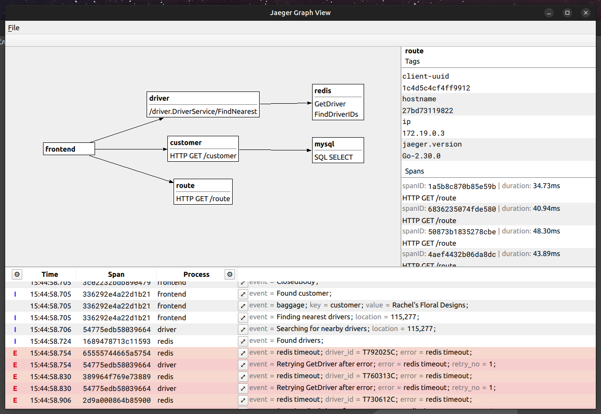

# jgv
Jaeger Graph View is ui tools for Jaeger on Qt and GraphViz

## Features

* Services map;
* Flat log.

## Build from source

### Requirements

* Qt >= 6;
* GraphViz(libcdt, libgvc, libcgraph).

#### GNU/Linux

    $ mkdir build
    $ cd build
    $ cmake -DCMAKE_BUILD_TYPE=Release ..
    $ make
    $ ./jgv

## Thanks

